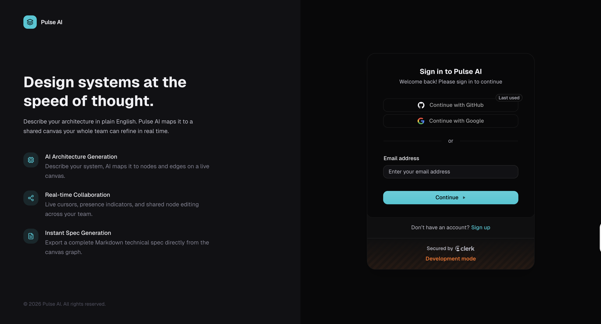

<div align="center">
  <h1 align="center">Pulse AI</h1>
  <h3 align="center">Real-Time Collaborative System Design Workspace</h3>
</div>

## <a name="introduction">Introduction</a>

Pulse AI is a real-time collaborative workspace for designing software systems. A user describes a system in plain English, an AI agent maps that description onto a shared canvas as nodes and edges, and collaborators jump in to refine the architecture together in real time. When the team is happy with the design, a second AI task converts the visual graph into a complete Markdown technical specification that can be reviewed and downloaded directly from the app.

Built on Next.js, Liveblocks, React Flow, Trigger.dev, and Prisma with PostgreSQL, Pulse AI brings together live multiplayer editing, durable background AI workflows, and persistent artifact storage in a single dark-themed technical workspace.

## 📋 <a name="table">Table of Contents</a>

1. 🔋 [Features](#features)
2. ⚙️ [Tech Stack](#tech-stack)
3. 🖼️ [Preview](#preview)
4. 🤸 [Quick Start](#quick-start)

## <a name="features">🔋 Features</a>

👉 **Authentication & Projects**: Sign in with Clerk, create projects, and manage ownership with route-level protection on every workspace.

👉 **Collaborative Canvas**: Edit a shared React Flow canvas in real time with live cursors, presence indicators, and instant node and edge synchronization across all connected users.

👉 **Starter System Designs**: Import prebuilt architecture templates — monolith, microservices, event-driven, serverless, and more — directly into the canvas at any point during editing.

👉 **AI Architecture Generation**: Describe a system in plain English and watch an AI agent draw the full node and edge graph into your shared room as a durable background task.

👉 **AI Spec Generation**: Convert the current canvas graph into a structured Markdown technical specification with a single click.

👉 **Multi-Spec Storage**: Each project keeps a library of generated specs — metadata lives in PostgreSQL, the Markdown content lives in Vercel Blob.

👉 **Downloadable Specs**: Open any generated spec in the app or download it as a Markdown file to share with your team.

👉 **Collaborator Access**: Add collaborators to any project so they can edit the canvas and trigger AI generation alongside the owner.

👉 **Auto-Saved Canvas**: Canvas snapshots are persisted automatically, so no work is lost between sessions.

👉 **Dark Technical UI**: A focused, dark-only workspace built with Tailwind, shadcn/ui, and a custom token system tuned for long design sessions.

And many more, including a clean separation between request handlers, durable background tasks, and artifact storage.

## <a name="tech-stack">⚙️ Tech Stack</a>

- [Next.js](https://nextjs.org/)
- [React](https://react.dev/)
- [TypeScript](https://www.typescriptlang.org/)
- [Tailwind CSS](https://tailwindcss.com/)
- [shadcn/ui](https://ui.shadcn.com/)
- [Clerk](https://clerk.com/)
- [Prisma](https://www.prisma.io/)
- [PostgreSQL](https://www.postgresql.org/)
- [Liveblocks](https://liveblocks.io/)
- [React Flow](https://reactflow.dev/)
- [Trigger.dev](https://trigger.dev/)
- [Vercel Blob](https://vercel.com/docs/storage/vercel-blob)

## <a name="preview">🖼️ Preview</a>

> Replace the placeholders below with real screenshots before publishing.

**Workspace — Collaborative Canvas**


**Home Page**


**Starter System Designs**


**AI Architecture Generation**


**Generated Spec View**


**Sign In/ Sign Up**



## <a name="quick-start">🤸 Quick Start</a>

Follow these steps to set up the project locally on your machine.

**Prerequisites**

Make sure you have the following installed on your machine:

- [Git](https://git-scm.com/)
- [Node.js](https://nodejs.org/en)
- [npm](https://www.npmjs.com/) (Node Package Manager)
  **Cloning the Repository**

```bash
git clone https://github.com/Viral-Ahir/pulse-ai.git
cd pulse-ai
```

**Installation**

Install the project dependencies using npm:

```bash
npm install
```

**Set Up Environment Variables**

Create a new file named `.env` in the root of your project and add the following content:

```env
# Clerk
NEXT_PUBLIC_CLERK_PUBLISHABLE_KEY=
CLERK_SECRET_KEY=
NEXT_PUBLIC_CLERK_SIGN_IN_URL=/sign-in
NEXT_PUBLIC_CLERK_SIGN_UP_URL=/sign-up

LIVEBLOCKS_SECRET_KEY=

TRIGGER_SECRET_KEY=
NEXT_PUBLIC_TRIGGER_PUBLIC_API_KEY=

DATABASE_URL=

━━━━━━━━━━━━━━━━━━━━
# Google
GOOGLE_AI_API_KEY=
# Optional: override the default Gemini model (default: gemini-2.5-flash)
GEMINI_MODEL=
# Optional: override model used specifically for spec generation
GEMINI_SPEC_MODEL=

━━━━━━━━━━━━━━━━━━━━
APP_URL=http://localhost:3000
```

Replace the placeholder values with your real credentials. You can get these by signing up at: [**Clerk**](https://jsm.dev/pulse-clerk), [**Liveblocks**](https://jsm.dev/pulse-liveblocks), [**Trigger.dev**](https://jsm.dev/pulse-triggerdev), [**Google AI Studio**](https://aistudio.google.com/).

**Running the Project**

```bash
npm run dev
```

Open [http://localhost:3000](http://localhost:3000) in your browser to view the project.

**Run Trigger.dev (Background Tasks)**

In a second terminal, start the Trigger.dev dev worker so background AI tasks execute locally:

```bash
npx trigger.dev@latest dev
```
